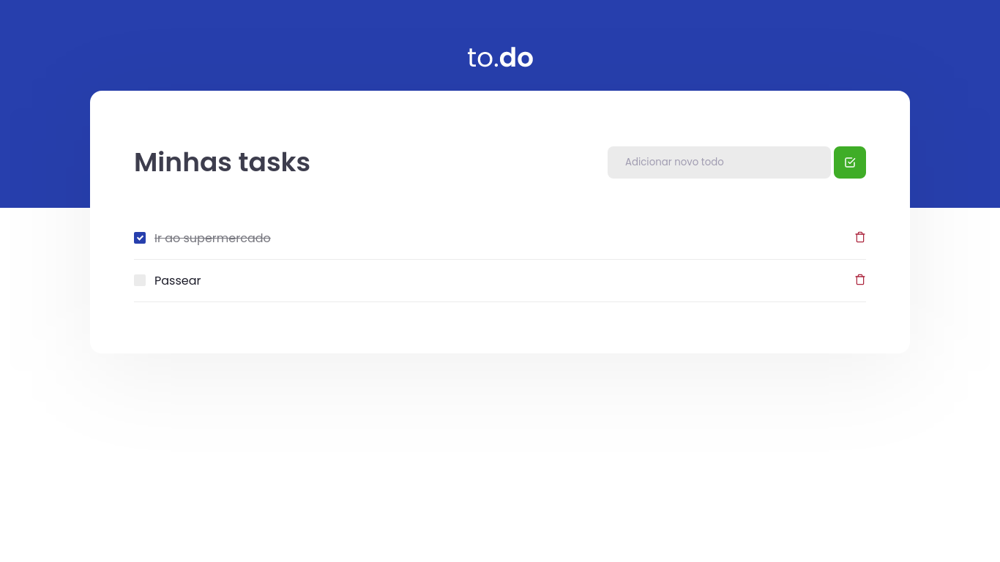

<h1 align="center">🚀 Rocketseat - 🔥Ignite - Trilha ReactJs</h1>

<h2 align="center">Desafio 01 : Conceitos do ReactJs ( Projeto to.do)</h2>

## 📖 Sobre o Projeto
O projeto consiste em uma aplicação de listagem de tarefas, que temos que implementar as funcionalidades de listagem, exclusão e complete da tarefa através de um markdown no checkbox de forma dinâmica.

## 🌠 Imagem do projeto 


## 🧰 Tecnologias Utilizadas
* ReactJS
* TypeScript
* SASS

## ⚙ Como rodar o projeto
#### Crie uma pasta 
```bash
mkdir react-ignite-conceitos
```
#### Clone este repositório para a pasta anterior ou use a opção de download:
```bash
git clone https://github.com/alissonrsantos/ignite-conceitos-reactjs.git
```
#### Instale as dependências
```bash
yarn install
```
ou
```bash
npm install
```

#### Executando o Projeto
```bash
yarn dev
``` 
ou
```bash
npm dev
```

#### Acesse http://localhost:8080 no seu navegador

## 🌎 Especificações do Projeto
[Desafio 01 - to.do](https://www.notion.so/Desafio-01-Conceitos-do-React-51e4099a6e2f4d4bae94f9fe75bb769d) - Notion com todas as informações.

## Licença
&copy; MIT

Feito com ❤ por Alisson Romão Santos | [LINKEDIN](https://www.linkedin.com/in/alissonrsantos).